# Laboratorio 01 - Sistemas Operativos
Elaborado por: 
- Carlos Andres Zuluaga Amaya
  andres.zuluaga6@udea.edu.co
- Duván Antonio Arboleda Botero
  duvan.arboleda1@udea.edu.co

Link de video: https://drive.google.com/file/d/1uKePFJJy-Red5sWJ-EEEqwORvbcZy4gK/view?usp=sharing 

## Introducción

Este laboratorio tiene como propósito profundizar de herramientas esenciales de la terminal de Linux. A través del desarrollo de utilidades clásicas como wcat, wgrep, winzip y winzip. Se busca fortalecer el dominio del lenguaje C, consolidar el uso de la consola de Linux como entorno de desarrollo principal, navegando por el sistema de archivos y gestionando procesos desde la terminal.

## Objetivo

- Explorar el manejo del lenguaje C.
- Practicar el manejo de la consola de Linux.
- Comprender cómo se implementan las utilidades de Linux.

Cada programa fue implementado y probado desde Visual Studio Code utilizando WSL. Antes de eso se instalo el compilador y las demas instalaciones

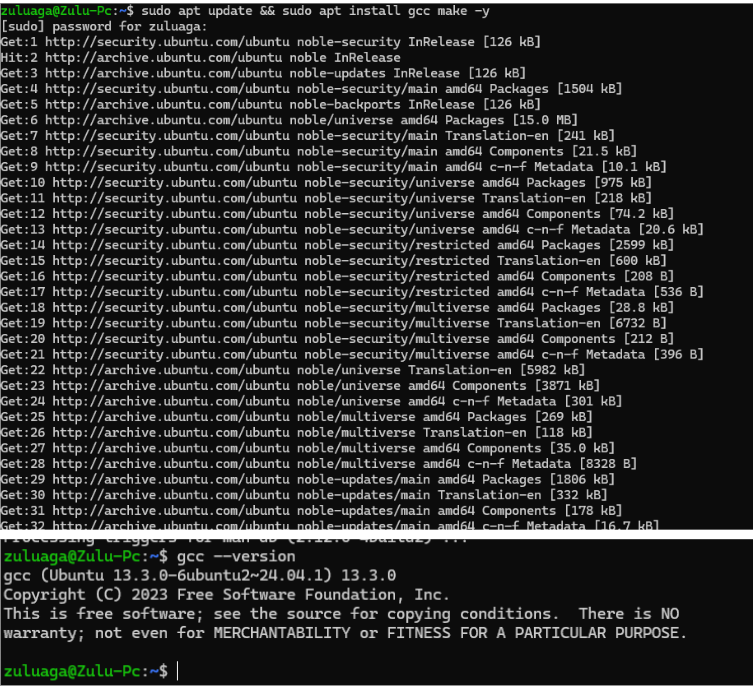

---

## Aplicación 1: wcat

Programa que muestra el contenido de uno o más archivos de texto en la salida.

1. Creamos y probamos el archivo wcat.c

2. Creamos el archivo prueba.txt.  Retorna hola mundo, es funcional 

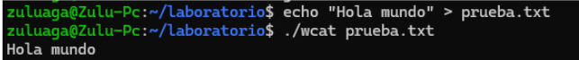

2.1. Detalles de la implementación:
Para la implementación creamos un archivo nuevo que cumpliera con todos los detalles que nos pedía el laboratorio

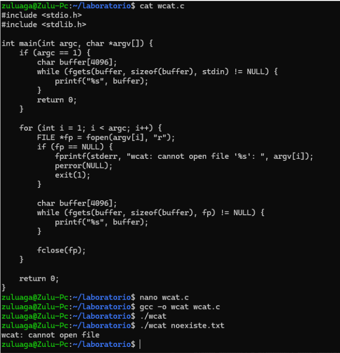

Como no se recibe archivos se debe terminar

- Para confirmar el punto 5 (Se especifican varios archivos en la línea de comandos, los archivos deben imprimirse en orden hasta que se llegue al final o a un error), creamos varios archivos a.txt y b.txt

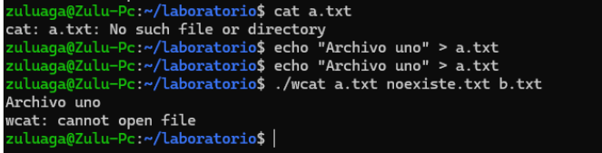

Vemos que nunca llegó a b.txt y salió de wcat, lo cuál era el resultado esperado

## Aplicación 2: wgrep

Programa que busca un término dentro de uno o más archivos y muestra únicamente las líneas que contienen ese texto. 
Aqui vemos el código de este programa 

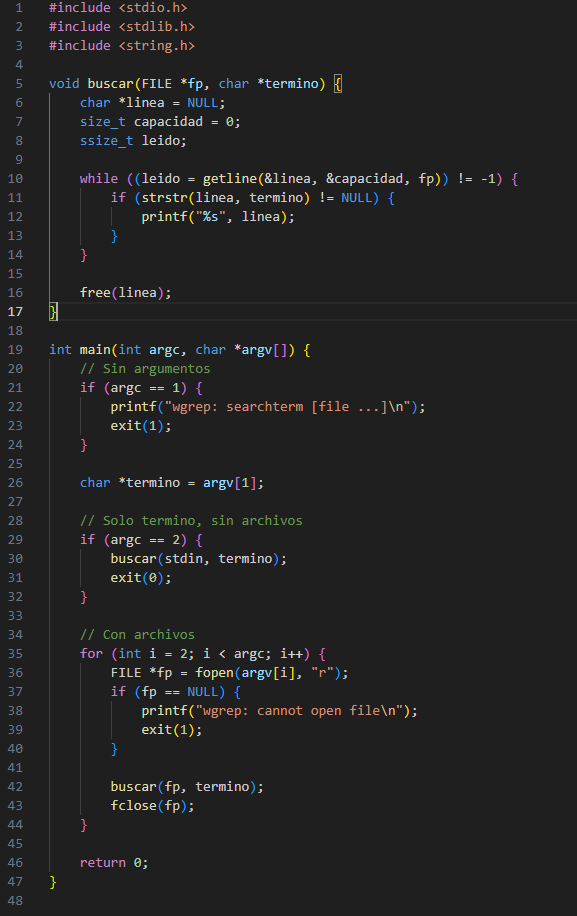

Tenemos el archivo prueba de la aplicación 

```bash
echo -e "this line has foo in it\nso does this foolish line\nthis one does not\neven barfood is here" > bar.txt
```
Todos los casos fueron aplicados y funcionales correctamente. Tenemos los siguientes casos:

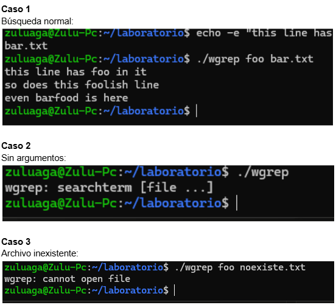
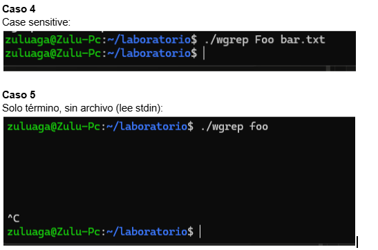

## Aplicación 3: wzip y wunzip

- Wzip: Programa que comprime archivos escribiendo la salida en formato binario.
- Wunzip: Programa que descomprime archivos generados por wzip, reconstruyendo el contenido original.

Creamos el archivo, nano wzip.c y tambien el archivo nano wunzip.c

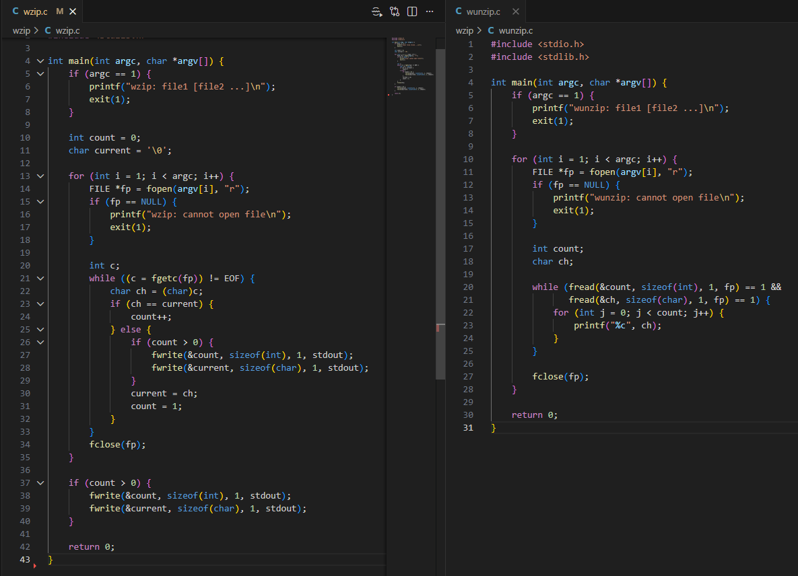

Ahora comenzamos con los archivos de prueba 

Creamos un archivo de prueba:
```bash
echo -n "aaaaaaaaaabbbb" > file.txt
```
Comprimimos:	
```bash
./wzip file.txt > file.z
```
Descomprime y verifica:

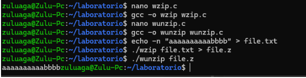

Verificamos que el archivo comprimido sea más pequeño:
```bash
ls -l file.txt file.z
```
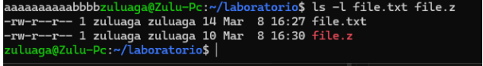

file.txt pesa 14 bytes, file.z pesa 10 bytes — se comprimió 

Otro ejemplo: 

aaaaabbb, es decir, hay 5 letras a seguidas y luego hay 3 letras b seguidas (5a3b)

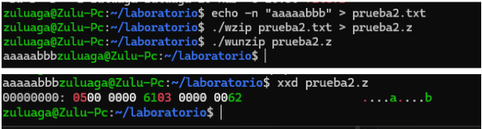

4.1 Detalles de implementación
Vamos a comprimir el contenido de los archivos a.txt y b.txt, para luego lee ambos archivos como si fueran una sola secuencia

./wzip a.txt b.txt > combinado.z

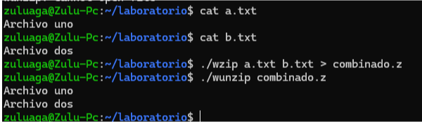
